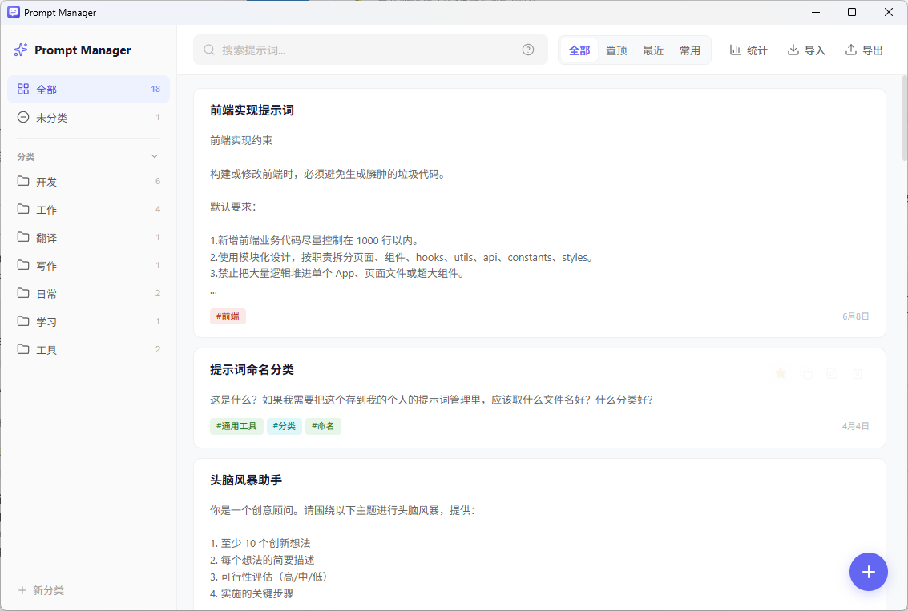

# Prompt Manager

一款本地优先的桌面提示词管理工具，帮助你整理、检索和复用常用 Prompt。

基于 Vue 3、TypeScript、Tauri 2、Rust 和 SQLite 构建。所有提示词默认只保存在本机，不依赖在线服务。

## 功能亮点

- 提示词、分类和标签管理
- 全文搜索，以及 `#标签`、`cat:分类` 组合查询
- 按标题、标签和内容权重排序搜索结果
- `Ctrl + K` 快速搜索，支持键盘选择和复制
- 全部、置顶、最近、常用四种浏览方式
- 复制次数、使用覆盖率、常用排行和成就统计
- JSON 导入预览、冲突提示与 JSON / Markdown 导出
- 删除后五秒内撤销，以及未保存内容保护

## 截图



## 安装

首个公开版本发布后，可在 GitHub Releases 页面下载 Windows 安装包或便携版。

从源码运行需要准备 [Node.js](https://nodejs.org/)、[Rust](https://www.rust-lang.org/tools/install) 和 [Tauri 2 系统依赖](https://v2.tauri.app/start/prerequisites/)。

```bash
npm install
npm run tauri dev
```

构建桌面安装包：

```bash
npm run tauri build
```

构建结果位于 `src-tauri/target/release/bundle/`。

## 搜索语法

| 写法 | 示例 | 作用 |
| --- | --- | --- |
| 普通关键词 | `周报` | 搜索标题、标签和内容 |
| 标签 | `#工作` | 只查看带有指定标签的提示词 |
| 分类 | `cat:开发` | 只查看指定分类中的提示词 |
| 组合搜索 | `周报 #工作` | 同时应用关键词和标签条件 |

普通搜索会优先展示标题匹配，其次是标签匹配和内容匹配。

## 数据与隐私

- 数据默认保存在本机 SQLite 数据库中，不会上传到云端。
- 成功复制提示词时，会在本地累计使用次数并更新最近使用时间。
- 查看或编辑提示词不会增加使用次数。
- Windows 数据目录：`%APPDATA%\\com.prompt-manager.app\\prompt-manager.db`
- JSON 仅用于手动导入和导出。

请妥善保护包含账号、密钥或其他敏感内容的提示词与导出文件。

## 开发与测试

```bash
# 前端类型检查与构建
npm run build

# Rust 测试
cargo test --manifest-path src-tauri/Cargo.toml
```

主要目录：

```text
src/              Vue 前端界面与交互
src-tauri/src/    Tauri 命令、Rust 模型与数据库逻辑
src-tauri/icons/  桌面应用图标
public/           静态资源
```

## 参与贡献

欢迎提交问题、功能建议和代码改进。第一次参与时可以先阅读 [CONTRIBUTING.md](CONTRIBUTING.md)。

## 许可证

本项目使用 [MIT License](LICENSE)，Copyright (c) 2026 Akko。
